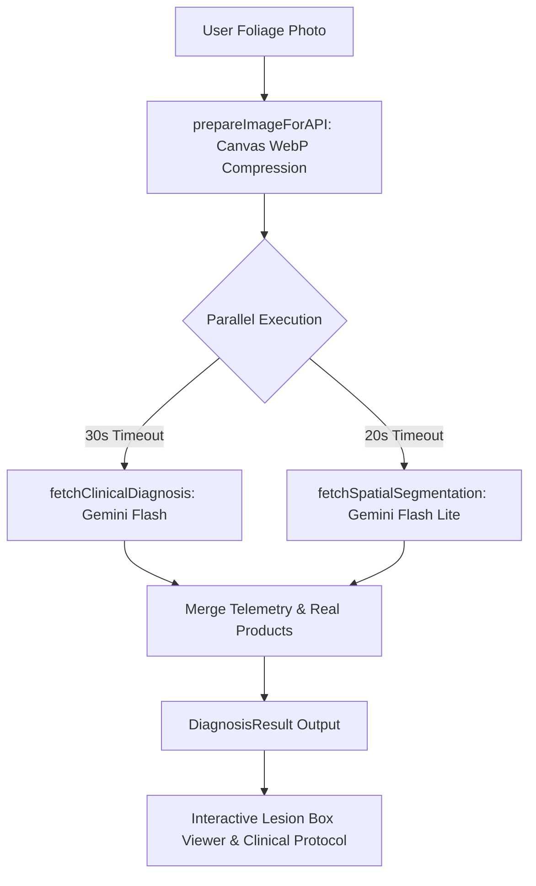

# AGENTS.md — PlantDoc AI Architecture & Engineering Guidebook 🌿🤖

Welcome to the **PlantDoc AI** codebase architecture and agent engineering guide. This document serves as the canonical technical reference, design system specification, and implementation playbook for AI coding assistants and developers maintaining or extending this platform.

---

## 📑 Table of Contents
1. [Executive Summary & Tech Stack](#1-executive-summary--tech-stack)
2. [Codebase Directory Structure](#2-codebase-directory-structure)
3. [Vision AI & Diagnostics Architecture](#3-vision-ai--diagnostics-architecture)
4. [Hero Stage Dual-Masking Mechanics](#4-hero-stage-dual-masking-mechanics)
5. [Botanical Recommendation & Wikimedia API Engine](#5-botanical-recommendation--wikimedia-api-engine)
6. [120fps Performance, Motion & Scroll Architecture](#6-120fps-performance-motion--scroll-architecture)
7. [Design Tokens & UI Component Hierarchy](#7-design-tokens--ui-component-hierarchy)
8. [Error Resilience & User-Facing Error Mapping](#8-error-resilience--user-facing-error-mapping)
9. [Build, Bundling & Cloudflare Pages Deployment](#9-build-bundling--cloudflare-pages-deployment)
10. [Rules & Conventions for AI Agents](#10-rules--conventions-for-ai-agents)

---

## 1. Executive Summary & Tech Stack

**PlantDoc AI** is a client-side single page application (SPA) providing real-time botanical disease diagnosis, 2D foliar lesion localization, clinical prescription matrix formulation, and climate-matched plant recommendations.

### Core Technology Stack:
- **Framework**: React 18 (TypeScript 5.x)
- **Bundler & Build Tool**: Vite 5.x with `@vitejs/plugin-react-swc`
- **Styling**: Tailwind CSS v3 with custom botanical HSL tokens & PostCSS
- **Animation & Kinetics**: 
  - [Lenis](https://github.com/darkroomengineering/lenis) (Smooth kinetic inertial scrolling)
  - [GSAP 3](https://greensock.com/gsap/) with `ScrollTrigger`
  - [Framer Motion](https://www.framer.com/motion/) (Micro-interactions & page transitions)
- **UI Components & Icons**: Radix UI primitives, Lucide React icons, Sonner toast notifications
- **AI Models**: Google Gemini Vision API (`gemini-2.5-flash` / `gemini-2.0-flash` / `gemini-3.6-flash` endpoints via `v1beta`)
- **Data Integrations**: Wikimedia Foundation REST APIs (Authentic scientific botanical photography & taxonomy)
- **Hosting & Edge Routing**: Cloudflare Pages with `public/_redirects`

---

## 2. Codebase Directory Structure

```
plantdoc/
├── public/
│   ├── demo/                               # Platform screenshot showcases
│   ├── bannerr.jpg                         # 1280x640 Social media & OpenGraph banner
│   ├── main.webp                           # Base healthy foliage specimen
│   ├── main_disease.webp                   # Pathology reveal foliage specimen
│   └── _redirects                          # Cloudflare Pages SPA rewrite rule (/* /index.html 200)
├── src/
│   ├── components/
│   │   ├── ui/                             # Radix UI wrapper primitives (accordion, button, card, dialog, etc.)
│   │   ├── ClinicalTreatmentProtocol.tsx   # 5-tier remediation checklist & brand prescriptions
│   │   ├── DiagnosisVisualizations.tsx     # Vital score rings, radar charts, & NPK advice
│   │   ├── DynamicBackground.tsx           # Canvas spore particles with scroll-pause optimization
│   │   ├── FixedMobileNav.tsx              # Floating mobile bottom dock navigation
│   │   ├── Footer.tsx                      # Global footer with navigation links & credits
│   │   ├── Header.tsx                      # Sticky frosted glass header with navigation
│   │   ├── MetricsShowcase.tsx             # Animated clinical performance metrics & counters
│   │   ├── ParallaxSection.tsx             # 3D interactive intelligence showcase cards
│   │   ├── PlantDocHeroStage.tsx           # Dual-masking 100dvh interactive cursor/touch stage
│   │   ├── PlantSegmentationViewer.tsx     # Interactive foliar lesion bounding box inspector
│   │   ├── ResultComponent.tsx             # Master diagnosis dashboard container
│   │   ├── ScrollProgressBar.tsx           # Desktop-only top scroll progress indicator
│   │   ├── SmoothScroll.tsx                # Lenis + GSAP ticker synchronization wrapper
│   │   ├── SpotlightCard.tsx               # GPU-accelerated mouse spotlight border effect
│   │   └── UploadComponent.tsx             # Drag-and-drop foliar photo uploader
│   ├── config/
│   │   └── api.config.ts                   # Gemini API endpoints & model identifiers
│   ├── hooks/
│   │   ├── use-mobile.tsx                  # Responsive viewport detection hook
│   │   └── use-toast.ts                    # Radix toast state hook
│   ├── pages/
│   │   ├── AboutPage.tsx                   # System architecture & developer info
│   │   ├── DiagnosePage.tsx                # Upload & diagnosis execution view
│   │   ├── Index.tsx                       # Landing page with hero & parallax sections
│   │   ├── NotFound.tsx                    # 404 error fallback route
│   │   └── RecommendPage.tsx               # Climate-adaptive botanical recommendation engine
│   ├── services/
│   │   ├── api.ts                          # Vision API calls, WebP compressor & error formatter
│   │   └── wikimedia.ts                    # Wikimedia REST API client & cache
│   ├── types/
│   │   ├── diagnosis.ts                    # Diagnosis result & lesion coordinate interfaces
│   │   └── recommendation.ts               # Botanical recommendation & climate interfaces
│   ├── App.tsx                             # React Router configuration & root providers
│   ├── index.css                           # Custom Tailwind layers, glassmorphism & font tokens
│   └── main.tsx                            # React DOM entrypoint
├── .env                                    # Environment variables (VITE_GEMINI_API_KEY)
├── tailwind.config.ts                      # Tailwind tokens, keyframes & animations
├── tsconfig.json                           # TypeScript compiler configuration
└── vite.config.ts                          # Vite rollup code-splitting & esbuild rules
```

---

## 3. Vision AI & Diagnostics Architecture

The vision diagnostics pipeline processes user photos through an optimized client-side and cloud architecture:



### Key Implementation Details (`src/services/api.ts`):
1. **Client-Side WebP Downsampling (`prepareImageForAPI`)**:
   - Caps input resolution to `1280px` max dimension on an offscreen HTML5 Canvas.
   - Encodes as progressive WebP (`0.85` quality) with JPEG fallback.
   - Reduces multi-megabyte DSLR/smartphone uploads down to **~80KB–150KB** (99% network payload reduction), boosting API response latency by **5x–10x**.
2. **Parallel Dual-Model Pipeline**:
   - **Model 1 (`fetchClinicalDiagnosis`)**: Generates botanical classification, disease name, confidence scores, real retail brand chemicals (e.g. *Daconil*, *Bonide*), organic recipes, and NPK fertilizer advice.
   - **Model 2 (`fetchSpatialSegmentation`)**: Computes sub-pixel 2D bounding boxes `[ymin, xmin, ymax, xmax]` tightly wrapping individual lesion spots.
3. **Non-Blocking Architecture**:
   - If segmentation times out (20s) or returns empty, it falls back cleanly to `{ lesions: [] }` so the primary clinical report is **never blocked**.

---

## 4. Hero Stage Dual-Masking Mechanics

The hero stage ([PlantDocHeroStage.tsx](file:///c:/Users/Admin/Downloads/plantdoc/plantdoc/src/components/PlantDocHeroStage.tsx)) displays an interactive foliar reveal where hovering or dragging reveals the diseased foliage layer (`main_disease.webp`).

### The Dual-Mask Algorithm:
1. **Top Pathology Layer (`topLayerRef`)**:
   - Holds `main_disease.webp` (transparent in empty space).
   - Driven by `maskCanvas`, drawing smooth organic multi-vertex morph blobs with a multi-stop radial gradient:
     - `0% - 70%`: `rgba(255, 255, 255, alpha)` (100% pathology clarity inside the spotlight).
     - `70% - 100%`: Soft feathered falloff to `rgba(255, 255, 255, 0)` (eliminates any visible hard circle ring).
2. **Base Healthy Layer (`baseLayerRef`)**:
   - Holds `main.webp` wrapped in `ref={baseLayerRef}`.
   - Driven by `invCanvas` (`invCtx.globalCompositeOperation = 'destination-out'`), cutting a hole in the healthy leaf directly beneath the spotlight.
3. **The Visual Outcome**:
   - **On the Leaf**: Necrotic holes and eaten-away leaf tissue reveal the dark background directly through the leaf with zero healthy foliage bleeding through.
   - **In Empty Space**: Because both images are transparent in empty air, no dark shapes or blobs are rendered over the white "PLANTDOC" lettermark.

### Device-Specific Spotlight Radii:
- **Mobile Touch**: `0.32` factor (`TRAIL_HEAD_R * 0.32`) for compact touch precision under the fingertip.
- **Desktop Cursor**: `0.64` factor (`TRAIL_HEAD_R * 0.64`) for an expansive desktop pathology inspection window.

---

## 5. Botanical Recommendation & Wikimedia API Engine

The recommendation system matches plants against regional environmental parameters (temperature, annual rainfall, humidity, soil type, and pH).

### Architecture (`src/services/wikimedia.ts` & `api.ts`):
1. **Zero Mock Synthetic Data**: All recommended plants query the official **Wikimedia Foundation REST API** in real-time.
2. **Parallel Image & Summary Resolution**:
   - Queries `https://en.wikipedia.org/api/rest_v1/page/summary/{title}` using the scientific Latin binomial.
   - Resolves authentic high-resolution thumbnail images, Wikipedia page URLs, and validated botanical summaries.
   - Implements in-memory caching to eliminate redundant network requests.
3. **Category Filtering**: Supports filtering by **Mix (Default)**, **Crops & Veggies**, **Fruit Trees**, **Flowers & Ornamentals**, and **Herbs**.

---

## 6. 120fps Performance, Motion & Scroll Architecture

PlantDoc AI is engineered for sustained 120Hz display refresh rates on both desktop and mobile devices:

1. **Zero-Allocation Mutation Loops**:
   - Point arrays in `PlantDocHeroStage.tsx` use in-place reverse mutation (`for (let i = points.length - 1; i >= 0; i--)`) and preallocated `Float32Array(32)` polygon vertex buffers.
   - **0 bytes of Garbage Collection (GC) allocations per frame**, eliminating GC frame drops.
2. **Scroll-Paused Particles (`DynamicBackground.tsx`)**:
   - Automatically pauses background spore canvas redraws during active touch scrolling to dedicate 100% of GPU resources to kinetic scrolling.
3. **Synchronized Smooth Scroll (`SmoothScroll.tsx`)**:
   - Lenis smooth scroll engine configured with `duration: 1.2s`, `wheelMultiplier: 1.0`, and `touchMultiplier: 1.15`.
   - Connected directly to GSAP's internal RAF ticker with `gsap.ticker.lagSmoothing(500, 33)` to prevent jumpy frame interpolation.
4. **CSS `content-visibility: auto`**:
   - Applied to below-the-fold sections in `index.css` to skip layout and paint calculations until approached by the scroll viewport.
5. **Component Memoization**:
   - All high-frequency cards and pages ([DiagnosePage.tsx](file:///c:/Users/Admin/Downloads/plantdoc/plantdoc/src/pages/DiagnosePage.tsx), [RecommendPage.tsx](file:///c:/Users/Admin/Downloads/plantdoc/plantdoc/src/pages/RecommendPage.tsx), [AboutPage.tsx](file:///c:/Users/Admin/Downloads/plantdoc/plantdoc/src/pages/AboutPage.tsx), `ParallaxSection.tsx`) are wrapped in `React.memo`.

---

## 7. Design Tokens & UI Component Hierarchy

PlantDoc AI uses a dark botanical luxury aesthetic with frosted glassmorphism:

### Color Palette:
- **Primary Emerald / Turquoise**: `#2DD4BF` (Teal 400), `#10B981` (Emerald 500), `#059669` (Emerald 600)
- **Background Dark Void**: `#060807` / `#0B0F0D` (Deep foliar black)
- **Glass Surfaces**: `rgba(0, 0, 0, 0.55)` with `backdrop-blur-2xl` and `border-white/10`
- **Text & Accents**: `#FFFFFF` for primary headings, `rgba(255, 255, 255, 0.8)` for body copy, `#5EEAD4` for active highlights

### Component Guidelines:
- **Buttons**:
  - Primary: Gradient `from-[#2DD4BF] via-[#10B981] to-[#059669]` with `text-black font-extrabold`.
  - Secondary/Outline: `bg-black/55 backdrop-blur-2xl border-white/20 text-white hover:text-[#5EEAD4]`.
- **Responsive Controls**:
  - PC viewports use `px-8 py-5 text-base` with larger `h-5` icons.
  - Mobile viewports use `px-3 py-2 text-[10px]` with compact gaps.

---

## 8. Error Resilience & User-Facing Error Mapping

Raw API errors, HTTP codes, and quota notices must **never** leak to the user interface.

### Error Mapping Reference (`src/services/api.ts` -> `formatUserFriendlyError`):

| Technical Cause | HTTP Code | User-Facing Message |
| :--- | :--- | :--- |
| Rate Limit / Quota | `429` / `RESOURCE_EXHAUSTED` | *"Our diagnostic AI servers are currently experiencing high request volume. Please wait a few seconds and try again."* |
| Network Stalled / Dropped | `AbortError` / `TypeError: Failed to fetch` | *"Network connection issue detected. Please check your internet connection and try again."* |
| Upstream Server Issue | `500` / `502` / `503` / `504` | *"AI diagnostic servers are momentarily busy. Please try again in a few moments."* |
| Unusable Photo Format | `400` / Invalid base64 | *"Unable to process the foliage image. Please upload a clear, well-lit photo of the plant."* |
| Unparseable Model Output | JSON parse error / Empty | *"The diagnosis could not be processed. Please ensure the plant leaf is clearly visible and try again."* |

### Loading State Safety:
All asynchronous calls (`handleDiagnose`, `handleGetRecommendations`) must execute `setIsLoading(false)` inside a mandatory `finally` block to guarantee the UI never gets stuck in a loading state.

---

## 9. Build, Bundling & Cloudflare Pages Deployment

### Vite Build Configuration (`vite.config.ts`):
- **esbuild Dead-Code Stripping**: Automatically drops `console.*` and `debugger` statements in production builds (`legalComments: 'none'`).
- **Manual Chunk Splitting**:
  - `vendor-react`: `react`, `react-dom`, `react-router-dom` (~159 KB)
  - `vendor-animation`: `framer-motion`, `gsap`, `lenis` (~213 KB)
  - `vendor-radix`: `@radix-ui/*` primitives (~92 KB)
  - `vendor-icons`: `lucide-react` (~15.9 KB)
- **Asset Inlining Limit**: `4096` bytes.

### Cloudflare Pages Deployment:
- **Build Command**: `npm run build`
- **Output Directory**: `dist`
- **Node.js Version**: `22` (or >= 18)
- **SPA Routing**: Handled natively by `public/_redirects` (`/* /index.html 200`). Do **not** re-add a `wrangler.toml` file with a `[build]` table.

---

## 10. Rules & Conventions for AI Agents

When modifying or extending the PlantDoc AI codebase, you **must** adhere to the following rules:

1. **TypeScript Hygiene**: Maintain **0 compiler errors**. Always verify with `npx tsc --noEmit`.
2. **Image Attributes**: Never add non-standard `fetchpriority` attributes directly on standard HTML `` elements; use standard React 18 attributes (`loading="eager"` / `loading="lazy"` and `decoding="async"`).
3. **No Placeholders**: Never insert synthetic placeholder images. Use `fetchPlantWikimediaData` for real botanical media.
4. **Preserve Dual-Masking Integrity**: When modifying `PlantDocHeroStage.tsx`, ensure `topLayerRef` and `baseLayerRef` masks remain synchronized and zero garbage-collection allocations occur inside `renderLoop`.
5. **User-Friendly Error Handling**: Always pass API catch errors through `formatUserFriendlyError` before setting error states or displaying toasts.
6. **Documentation Integrity**: Preserve existing architectural comments and update `README.md` / `walkthrough.md` when introducing new features.
