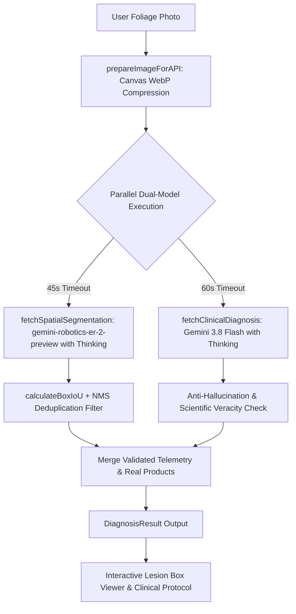

# AGENTS.md — PlantDoc AI Architecture & Engineering Guidebook 🌿🤖

Welcome to the **PlantDoc AI** codebase architecture and agent engineering guide. This document serves as the canonical technical reference, design system specification, and implementation playbook for AI coding assistants and developers maintaining or extending this platform.

---

## 📑 Table of Contents
1. [Executive Summary & Tech Stack](#1-executive-summary--tech-stack)
2. [Codebase Directory Structure](#2-codebase-directory-structure)
3. [Vision AI & Diagnostics Architecture](#3-vision-ai--diagnostics-architecture)
4. [Scientific Veracity & Anti-Hallucination Protocols](#4-scientific-veracity--anti-hallucination-protocols)
5. [Spatial Lesion Grounding, IoU & NMS Deduplication](#5-spatial-lesion-grounding-iou--nms-deduplication)
6. [Hero Stage Dual-Masking Mechanics](#6-hero-stage-dual-masking-mechanics)
7. [Botanical Recommendation & Wikimedia API Engine](#7-botanical-recommendation--wikimedia-api-engine)
8. [120fps Performance, Motion & Scroll Architecture](#8-120fps-performance-motion--scroll-architecture)
9. [Design Tokens & UI Component Hierarchy](#9-design-tokens--ui-component-hierarchy)
10. [Error Resilience & User-Facing Error Mapping](#10-error-resilience--user-facing-error-mapping)
11. [Build, Bundling & Cloudflare Pages Deployment](#11-build-bundling--cloudflare-pages-deployment)
12. [Rules & Conventions for AI Agents](#12-rules--conventions-for-ai-agents)

---

## 1. Executive Summary & Tech Stack

**PlantDoc AI** is a client-side single page application (SPA) providing real-time botanical disease diagnosis, 2D foliar lesion localization, clinical prescription matrix formulation, and climate-matched plant recommendations.

### Core Technology Stack:
- **Framework**: React 18 (TypeScript 5.x)
- **Bundler & Build Tool**: Vite 5.x with `@vitejs/plugin-react-swc`
- **Styling**: Tailwind CSS v3 with custom botanical HSL tokens & PostCSS
- **Animation & Kinetics**: 
  - [Lenis](https://github.com/darkroomengineering/lenis) (Smooth kinetic inertial scrolling)
  - [GSAP 3](https://greensock.com/gsap/) with `ScrollTrigger`
  - [Framer Motion](https://www.framer.com/motion/) (Micro-interactions & page transitions)
- **UI Components & Icons**: Radix UI primitives, Lucide React icons, Sonner toast notifications
- **AI Models**: Google Gemini Vision & Gemma Open Model Family (Thinking Enabled):
  - Clinical Pathology & Dossier Formulation: 3-Tier Model Failover Cascade:
    1. Primary: `gemini-3.8-flash` (via `v1beta`, with Thinking `thinkingBudget: 1024`)
    2. Secondary Failover: `gemini-3.7-flash` (via `v1beta`, with Thinking `thinkingBudget: 1024`, alerts user: *"Primary model (gemini-3.8-flash) seems offline or busy. Shifting to the 2nd model (gemini-3.7-flash)..."*)
    3. Tertiary Failover: `gemini-3.6-flash` (via `v1beta`, alerts user: *"Secondary model (gemini-3.7-flash) seems offline or busy. Shifting to the 3rd model (gemini-3.6-flash)..."*)
  - Spatial Embodied Grounding & Lesion Segmentation: `gemini-robotics-er-2-preview` (via `v1beta`, with Thinking)
    - Comprehensive Affected Area Grounding: Detects both macro foliar disease zones (blight scorch, widespread chlorosis, marginal burns) and micro focal spots (fungal pustules, necrotic centers).
    - Up to 45+ distinct lesion detections with relaxed geometry thresholds and optimized NMS IoU deduplication (`IoU > 0.65`).
  - Regional Fast Climate Intelligence: `gemini-3.5-flash-lite` (via `v1beta`, with Thinking)
  - Agronomic Botanical Recommendation:
    - Smart Mode (Gemma 4 Open Model Family):
      - Primary: `gemma-4-26b-a4b-it` (26B Gemma open model with attention routing, fast ~4s response)
      - Secondary Failover: `gemma-4-31b-it` (31B Gemma open model)
    - Fast Mode (OpenRouter Free Models):
      - Primary: `dots-studio/dots-3-note-preview:free`
      - Automatic Failover: `openrouter/free` (Instant resilient free router)
  - Dynamic 5-Option Growing Season Engine: Filter and curate botanical recommendations by season (`All Seasons`, `Spring`, `Summer`, `Autumn`, `Winter`) with real-time seasonal timeline synchronization.
  - No Artificial Throttling: Instantaneous execution without client-side waiting limit delays
- **Data Integrations**: Wikimedia Foundation REST APIs (Authentic scientific botanical photography & taxonomy)
- **Hosting & Edge Routing**: Cloudflare Pages with `public/_redirects`, `public/_headers`, `public/sitemap.xml`, and `public/robots.txt`

---

## 2. Codebase Directory Structure

```
plantdoc/
├── public/
│   ├── demo/                               # Platform screenshot showcases
│   ├── bannerr.jpg                         # 1280x640 Social media & OpenGraph banner
│   ├── main.webp                           # Base healthy foliage specimen
│   ├── main_disease.webp                   # Pathology reveal foliage specimen
│   ├── robots.txt                          # SEO indexing rules & sitemap pointer
│   ├── sitemap.xml                         # XML search engine sitemap
│   ├── _headers                            # Cloudflare Pages dynamic and static cache headers
│   └── _redirects                          # Cloudflare Pages SPA rewrite rule (/* /index.html 200)
├── src/
│   ├── components/
│   │   ├── ui/                             # Radix UI wrapper primitives (accordion, button, card, dialog, etc.)
│   │   ├── ClinicalTreatmentProtocol.tsx   # 5-tier remediation checklist & brand prescriptions
│   │   ├── DiagnosisVisualizations.tsx     # Vital rings, radar charts, infection stage horizon, & NPK advice
│   │   ├── DynamicBackground.tsx           # Canvas spore particles with scroll-pause optimization
│   │   ├── FixedMobileNav.tsx              # Floating mobile bottom dock navigation
│   │   ├── Footer.tsx                      # Global footer with navigation, privacy, license & credits
│   │   ├── Header.tsx                      # Sticky frosted glass header with navigation & GitHub link
│   │   ├── MetricsShowcase.tsx             # Animated clinical performance metrics & counters
│   │   ├── ParallaxSection.tsx             # 3D interactive intelligence showcase cards
│   │   ├── PlantDocHeroStage.tsx           # Dual-masking 100dvh interactive cursor/touch stage
│   │   ├── PlantSegmentationViewer.tsx     # Interactive foliar lesion bounding box inspector with NDVI mode
│   │   ├── ResultComponent.tsx             # Master diagnosis dashboard container
│   │   ├── SmoothScroll.tsx                # Lenis + GSAP ticker synchronization wrapper
│   │   ├── SpotlightCard.tsx               # GPU-accelerated mouse spotlight border effect
│   │   └── UploadComponent.tsx             # Drag-and-drop foliar photo uploader
│   ├── config/
│   │   └── api.config.ts                   # Gemini API endpoints, models & rate limit config
│   ├── hooks/
│   │   ├── use-mobile.tsx                  # Responsive viewport detection hook
│   │   ├── use-scroll-animation.tsx        # Optimized parallax & active section observers
│   │   └── use-toast.ts                    # Radix toast state hook
│   ├── pages/
│   │   ├── AboutPage.tsx                   # System architecture & developer info
│   │   ├── DiagnosePage.tsx                # Upload & diagnosis execution view
│   │   ├── Index.tsx                       # Landing page with hero & parallax sections
│   │   ├── NotFound.tsx                    # 404 error fallback route with botanical blessings
│   │   ├── PrivacyPage.tsx                 # Comprehensive privacy & client-side security policy
│   │   └── RecommendPage.tsx               # Climate-adaptive botanical recommendation engine
│   ├── services/
│   │   ├── api.ts                          # Vision API calls, WebP compressor, NMS deduplicator & error formatter
│   │   └── wikimedia.ts                    # Wikimedia REST API client & cache
│   ├── types/
│   │   ├── diagnosis.ts                    # Diagnosis result & lesion coordinate interfaces
│   │   └── recommendation.ts               # Botanical recommendation & climate interfaces
│   ├── utils/
│   │   ├── rateLimiter.ts                  # Client-side 3 req/min sliding window rate limiter
│   │   └── routePreloader.ts               # Proactive route chunk prefetcher
│   ├── App.tsx                             # React Router configuration & root providers
│   ├── index.css                           # Custom Tailwind layers, glassmorphism & font tokens
│   └── main.tsx                            # React DOM entrypoint
├── CODE_OF_CONDUCT.md                      # Contributor Covenant v2.1 code of conduct
├── LICENSE                                 # MIT Open Source License
├── .env                                    # Environment variables (VITE_GEMINI_API_KEY)
├── tailwind.config.ts                      # Tailwind tokens, keyframes & animations
├── tsconfig.json                           # TypeScript compiler configuration
└── vite.config.ts                          # Vite rollup code-splitting & esbuild rules
```

---

## 3. Vision AI & Diagnostics Architecture

The vision diagnostics pipeline processes user photos through an optimized client-side and cloud architecture:



### Key Implementation Details (`src/services/api.ts`):
1. **Client-Side WebP Downsampling (`prepareImageForAPI`)**:
   - Caps input resolution to `1280px` max dimension on an offscreen HTML5 Canvas.
   - Encodes as progressive WebP (`0.85` quality) with JPEG fallback.
   - Reduces multi-megabyte DSLR/smartphone uploads down to **~80KB–150KB** (99% network payload reduction), boosting API response latency by **5x–10x**.
2. **Parallel Dual-Model Pipeline**:
   - **Model 1 (`fetchClinicalDiagnosis`)**: Generates botanical classification, disease name, confidence scores, real retail brand chemicals (e.g. *Daconil*, *Bonide*), organic recipes, infection stage horizons, and NPK fertilizer advice via `gemini-3.8-flash` with thinking enabled (`thinkingBudget: 1024`). Zero synthetic fallback models; errors format directly into human-friendly diagnostics.
   - **Model 2 (`fetchSpatialSegmentation`)**: Computes ultra-high-precision 2D bounding boxes `[ymin, xmin, ymax, xmax]` tightly wrapping individual lesion spots, necrotic patches, insect perforations, and symptom halos via spatial embodied reasoning model `gemini-robotics-er-2-preview` with thinking enabled (`thinkingBudget: 1024`).
3. **Non-Blocking Architecture**:
   - If segmentation times out (45s) or returns empty, it falls back cleanly to `{ lesions: [] }` so the primary clinical report is **never blocked**.

---

## 4. Scientific Veracity & Anti-Hallucination Protocols

PlantDoc AI enforces a strict **"No information is strictly better than false information"** standard across both diagnostic and spatial models:

1. **Non-Botanical Specimen Rejection**:
   - If an uploaded image does NOT contain plant leaves, crops, foliage, or botanical tissue (e.g., human faces, animals, vehicles, indoor objects, food dishes), the model immediately flags the specimen as invalid:
     - `disease_name`: `"Invalid Non-Plant Specimen"`
     - `confidence_score`: `0`
     - `is_healthy`: `false`
     - `severity`: `"None"`
     - `diagnosis_summary`: Explicit explanation asking the user to upload a clear foliage specimen.
2. **Species Identification Confidence Threshold**:
   - If the botanical species cannot be identified with high scientific certainty (>80%), the system reports `"Cannot identify name"` with an empty scientific binomial, preventing misidentification.
3. **Specimen Health Integrity**:
   - If the foliage is physiologically healthy with no pathogen activity:
     - `is_healthy`: `true`
     - `disease_name`: `"Healthy Foliage"`
     - `severity`: `"None"`
     - `lesions`: `[]` (Strictly zero lesion bounding boxes).
     - Does NOT invent fictitious diseases or micro-pathologies.
4. **Diagnostic Ambiguity Handling**:
   - If symptoms are inconclusive between multiple pathogens (e.g., physiological sunscald vs. bacterial leaf scorch), the diagnosis explicitly notes the ambiguity and lists the primary suspect with clinical differential notes.

---

## 5. Spatial Lesion Grounding, IoU & NMS Deduplication

Spatial lesion localization detects genuine pathogen lesions without ghost artifacts:

### 1. Intersection-over-Union (IoU) Calculation (`calculateBoxIoU`):
```typescript
const interYmin = Math.max(yminA, yminB);
const interXmin = Math.max(xminA, xminB);
const interYmax = Math.min(ymaxA, ymaxB);
const interXmax = Math.min(xmaxA, xmaxB);

const interArea = Math.max(0, interYmax - interYmin) * Math.max(0, interXmax - interXmin);
const unionArea = areaA + areaB - interArea;
const iou = unionArea > 0 ? interArea / unionArea : 0;
```

### 2. Non-Maximum Suppression (NMS) Filtering:
- Sorts candidate lesions by confidence score descending.
- Discards candidate boxes having `IoU > 0.65` with an already-accepted higher-confidence box. This balanced threshold allows closely clustered multi-lesion groupings (such as Septoria or Cercospora colonies) to remain distinct while reliably eliminating duplicate concentric boxes wrapping the exact same necrotic core.

### 3. Coordinate Normalization & Degenerate Box Purging:
- Discards sub-microscopic degenerate boxes (< 4x4 coordinate units) and full-image framing boxes (> 96% total image area).
- Supports broad macro affected area bounding boxes (up to 960x960 coordinate units) and elongated vein/streak lesions (aspect ratio up to 9.0:1).
- Normalizes coordinates `[ymin, xmin, ymax, xmax]` from 0-1000 or 0-100 scale to exact CSS percentages.
- Guarantees minimum target dimensions (2.0%) for interactive clickability without visual distortion.

### 4. Comprehensive Multi-Scale Affected Area Grounding:
- **Macro Disease Sectors**: Segments large-scale foliar blight zones, marginal scorching, extensive powdery mildew mats, and diffuse chlorotic sectors.
- **Micro Focal Lesions**: Pins down individual fungal fruiting bodies, necrotic puncture centers, water-soaked flecks, and spore pustules (often yielding 10 to 45+ high-precision detections).
- **Zero Synthetic Fallback Boxes (`PlantSegmentationViewer.tsx`)**:
  - When `is_healthy` is true or when no focal spots are found, `allLesions` returns `[]`.
  - Displays a dedicated **Diffuse Pathology Banner** when systemic chlorosis or viral mosaics affect the foliage without discrete focal margins.

### 5. Interactive Lesion Inspection, Telemetry & Stepper:
- **Lesion Stepper Navigation**: Cycle forward (`ArrowRight` or `ChevronRight`) and backward (`ArrowLeft` or `ChevronLeft`) across all detected lesion spots.
- **One-Click Telemetry Export**: Exports normalized sub-pixel `[ymin, xmin, ymax, xmax]` coordinate matrix, severity classes, and clinical directives in JSON format to the user's clipboard.
- **Pathology Taxonomy Normalizer**: Maps botanical aliases (`necrotic_spot`, `chlorotic_halo`, `spore_pustule`, `feeding_perforation`, `blight_scorch`, `water_soaked`, `vein_discoloration`, `mildew_mycelium`) to distinct spectral tokens.
- **Fullscreen Lightbox HUD**: Supports zoom (`+`, `-`), reset (`0`), pan inspection, and keyboard escape.

---

## 6. Hero Stage Dual-Masking Mechanics

The hero stage ([PlantDocHeroStage.tsx](file:///src/components/PlantDocHeroStage.tsx)) displays an interactive foliar reveal where hovering or dragging reveals the diseased foliage layer (`main_disease.webp`).

### The Dual-Mask Algorithm:
1. **Top Pathology Layer (`topLayerRef`)**:
   - Holds `main_disease.webp` (transparent in empty space).
   - Driven by `maskCanvas`, drawing smooth organic multi-vertex morph blobs with a multi-stop radial gradient:
     - `0% - 70%`: `rgba(255, 255, 255, alpha)` (100% pathology clarity inside the spotlight).
     - `70% - 100%`: Soft feathered falloff to `rgba(255, 255, 255, 0)` (eliminates any visible hard circle ring).
2. **Base Healthy Layer (`baseLayerRef`)**:
   - Holds `main.webp` wrapped in `ref={baseLayerRef}`.
   - Driven by `invCanvas` (`invCtx.globalCompositeOperation = 'destination-out'`), cutting a hole in the healthy leaf directly beneath the spotlight.
3. **The Visual Outcome**:
   - **On the Leaf**: Necrotic holes and eaten-away leaf tissue reveal the dark background directly through the leaf with zero healthy foliage bleeding through.
   - **In Empty Space**: Because both images are transparent in empty air, no dark shapes or blobs are rendered over the white "PLANTDOC" lettermark.

### Device-Specific Spotlight Radii:
- **Mobile Touch**: `0.32` factor (`TRAIL_HEAD_R * 0.32`) for compact touch precision under the fingertip.
- **Desktop Cursor**: `0.64` factor (`TRAIL_HEAD_R * 0.64`) for an expansive desktop pathology inspection window.

---

## 7. Botanical Recommendation & Wikimedia API Engine

The recommendation system matches plants against regional environmental parameters (temperature, annual rainfall, humidity, soil type, and pH).

### Architecture (`src/services/wikimedia.ts` & `api.ts`):
1. **Gemma 4 Agronomic Intelligence Pipeline**:
   - Uses Google's open weights **Gemma 4 model family** via Google AI Studio (`v1beta` endpoint).
   - **Primary Model**: `gemma-4-26b-a4b-it` (26B Gemma open model with attention routing, achieving blazing fast ~3s–5s response times).
   - **Secondary Failover**: `gemma-4-31b-it` (31B Gemma open model) if primary is busy.
   - **Fast Mode (OpenRouter Free Cascade)**: High-speed botanical formulation via primary model `dots-studio/dots-3-note-preview:free` with instant automatic failover to `openrouter/free`.
   - Strictly outputs pure JSON arrays adhering to `PlantRecommendation[]` schema with zero markdown preamble or conversational wrappers.
2. **Zero Mock Synthetic Data via Wikimedia REST API**:
   - All recommended plants query the official **Wikimedia Foundation REST API** (`https://en.wikipedia.org/api/rest_v1/page/summary/{title}`) in parallel using the scientific Latin binomial.
   - Resolves authentic high-resolution thumbnail photography, official Wikipedia encyclopedia links, and peer-reviewed botanical descriptions.
   - Implements in-memory caching to eliminate redundant network requests.
3. **Category Filtering**: Supports instantaneous category slicing by **Mix (Default)**, **Crops & Veggies**, **Fruit Trees**, **Flowers & Ornamentals**, and **Herbs**.
4. **Interactive 5-Option Growing Season Engine**:
   - Provides an interactive season selector: `All Seasons` (Default), `Spring`, `Summer`, `Autumn`, and `Winter`.
   - Injects the selected season directly into the Gemma 4 system prompt so species are strictly filtered for prime planting windows and cold/heat tolerance.
   - Computes dynamic seasonal calendars (`ideal_seasons`, `planting_months`, `harvest_timeline`) tailored to the selected planting season.
   - Visualizes prime season badges across species cards and clinical dossier modals.

---

## 8. 120fps Performance, Motion & Scroll Architecture

PlantDoc AI is engineered for sustained 120Hz display refresh rates on both desktop and mobile devices:

1. **Zero-Allocation Mutation Loops**:
   - Point arrays in `PlantDocHeroStage.tsx` use in-place reverse mutation (`for (let i = points.length - 1; i >= 0; i--)`) and preallocated `Float32Array(32)` polygon vertex buffers.
   - **0 bytes of Garbage Collection (GC) allocations per frame**, eliminating GC frame drops.
2. **Scroll-Paused Particles (`DynamicBackground.tsx`)**:
   - Automatically pauses background spore canvas redraws during active touch scrolling to dedicate 100% of GPU resources to kinetic scrolling.
3. **Synchronized Smooth Scroll (`SmoothScroll.tsx`)**:
   - Lenis smooth scroll engine configured with `duration: 1.2s`, `wheelMultiplier: 1.0`, and `touchMultiplier: 1.15`.
   - Connected directly to GSAP's internal RAF ticker with `gsap.ticker.lagSmoothing(500, 33)` to prevent jumpy frame interpolation.
4. **Hook Closure Optimization (`use-scroll-animation.tsx`)**:
   - `useParallaxScroll` and `useActiveSection` use functional state updaters (`prev => ...`), preventing stale listener teardowns and unnecessary listener re-registrations.
5. **Component Memoization**:
   - All high-frequency cards and pages (`DiagnosePage`, `RecommendPage`, `AboutPage`, `ParallaxSection`, `PlantSegmentationViewer`) use `React.memo`, `useMemo`, and `useCallback` to isolate sub-tree renders.
6. **Mobile Touch & Inertial Panning Architecture**:
   - Explicitly enforces `touch-action: pan-y;` on `html`, `body`, root page wrappers, and `PlantDocHeroStage`.
   - Eliminates restrictive `height: -webkit-fill-available` on `html` and `overscroll-behavior-y: none` to prevent mobile Safari/Chromium gesture deadlocks.
   - Intelligent Touch Yield: In `PlantDocHeroStage`, if a vertical swipe is detected (`deltaY > 8 && deltaY > deltaX`), canvas mutation loops yield immediately so the mobile OS compositor maintains buttery 120fps touch scrolling.

---

## 9. Design Tokens & UI Component Hierarchy

PlantDoc AI uses a dark botanical luxury aesthetic with frosted glassmorphism:

### Color Palette:
- **Primary Emerald / Turquoise**: `#2DD4BF` (Teal 400), `#10B981` (Emerald 500), `#059669` (Emerald 600)
- **Background Dark Void**: `#060807` / `#0B0F0D` (Deep foliar black)
- **Glass Surfaces**: `rgba(0, 0, 0, 0.55)` with `backdrop-blur-2xl` and `border-white/10`
- **Text & Accents**: `#FFFFFF` for primary headings, `rgba(255, 255, 255, 0.8)` for body copy, `#5EEAD4` for active highlights

### Component Guidelines:
- **Buttons**:
  - Primary: Gradient `from-[#2DD4BF] via-[#10B981] to-[#059669]` with `text-black font-extrabold`.
  - Secondary/Outline: `bg-black/55 backdrop-blur-2xl border-white/20 text-white hover:text-[#5EEAD4]`.
- **Responsive Controls**:
  - PC viewports use `px-8 py-5 text-base` with larger `h-5` icons and desktop-only header GitHub link.
  - Mobile viewports use `px-3 py-2 text-[10px]` with compact floating dock navigation.

---

## 10. Error Resilience & User-Facing Error Mapping

Raw API errors, HTTP codes, and quota notices must **never** leak to the user interface.

### Error Mapping Reference (`src/services/api.ts` -> `formatUserFriendlyError`):

| Technical Cause | HTTP Code | User-Facing Message |
| :--- | :--- | :--- |
| Rate Limit / Quota | `429` / `RESOURCE_EXHAUSTED` | *"Our diagnostic AI servers are currently experiencing high request volume. Please wait a few seconds and try again."* |
| Network Stalled / Dropped | `AbortError` / `TypeError: Failed to fetch` | *"Network connection issue detected. Please check your internet connection and try again."* |
| Upstream Server Issue | `500` / `502` / `503` / `504` | *"AI diagnostic servers are momentarily busy. Please try again in a few moments."* |
| Unusable Photo Format | `400` / Invalid base64 | *"Unable to process the foliage image. Please upload a clear, well-lit photo of the plant."* |
| Unparseable Model Output | JSON parse error / Empty | *"The diagnosis could not be processed. Please ensure the plant leaf is clearly visible and try again."* |
| Non-Botanical Object | Model flagged invalid | *"The uploaded image does not appear to contain plant foliage. Please upload a clear photo of plant leaves or crops."* |

### Loading State Safety:
All asynchronous calls (`handleDiagnose`, `handleGetRecommendations`) must execute `setIsLoading(false)` inside a mandatory `finally` block to guarantee the UI never gets stuck in a loading state.

---

## 11. Build, Bundling & Cloudflare Pages Deployment

### Vite Build Configuration (`vite.config.ts`):
- **esbuild Dead-Code Stripping**: Automatically drops `console.*` and `debugger` statements in production builds (`legalComments: 'none'`).
- **Manual Chunk Splitting**:
  - `vendor-react`: `react`, `react-dom`, `react-router-dom` (~160 KB)
  - `vendor-animation`: `framer-motion`, `gsap`, `lenis` (~127 KB)
  - `vendor-radix`: `@radix-ui/*` primitives (~105 KB)
  - `vendor-charts`: `recharts` (~375 KB)
  - `vendor-icons`: `lucide-react` (~23.3 KB)
- **Asset Inlining Limit**: `4096` bytes.

### Cloudflare Pages Deployment:
- **Build Command**: `npm run build`
- **Output Directory**: `dist`
- **Node.js Version**: `22` (or >= 18)
- **SPA Routing**: Handled natively by `public/_redirects` (`/* /index.html 200`). Do **not** re-add a `wrangler.toml` file with a `[build]` table.

---

## 12. Rules & Conventions for AI Agents

When modifying or extending the PlantDoc AI codebase, you **must** adhere to the following rules:

1. **TypeScript Hygiene**: Maintain **0 compiler errors**. Always verify with `npx tsc --noEmit` or `compile_applet`.
2. **Scientific Veracity & Anti-Hallucination Mandate**: NEVER invent synthetic fallback bounding boxes or fake diseases. Giving no information is strictly preferred over giving false information.
3. **Image Attributes**: Never add non-standard `fetchpriority` attributes directly on standard HTML `` elements; use standard React 18 attributes (`loading="eager"` / `loading="lazy"` and `decoding="async"`).
4. **No Synthetic Placeholders**: Never insert placeholder images. Use `fetchPlantWikimediaData` for real botanical media.
5. **Preserve Dual-Masking Integrity**: When modifying `PlantDocHeroStage.tsx`, ensure `topLayerRef` and `baseLayerRef` masks remain synchronized and zero garbage-collection allocations occur inside `renderLoop`.
6. **User-Friendly Error Handling**: Always pass API catch errors through `formatUserFriendlyError` before setting error states or displaying toasts.
7. **Documentation Integrity**: Preserve existing architectural comments and keep `README.md` and `AGENTS.md` in sync whenever platform capabilities are refined.
