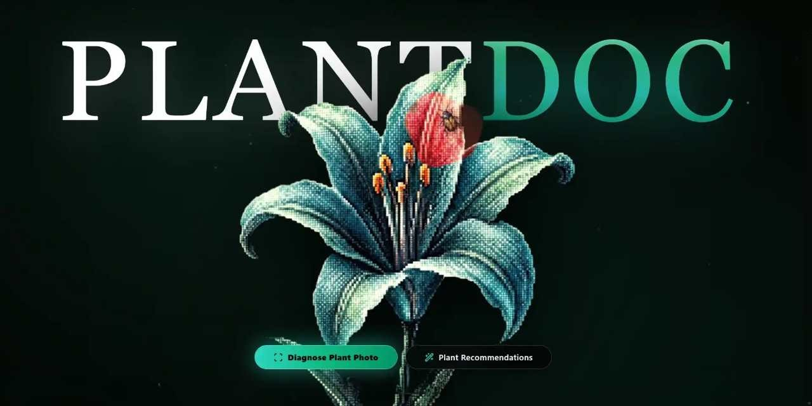
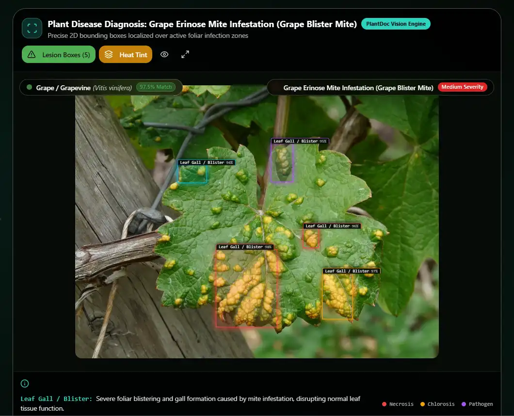
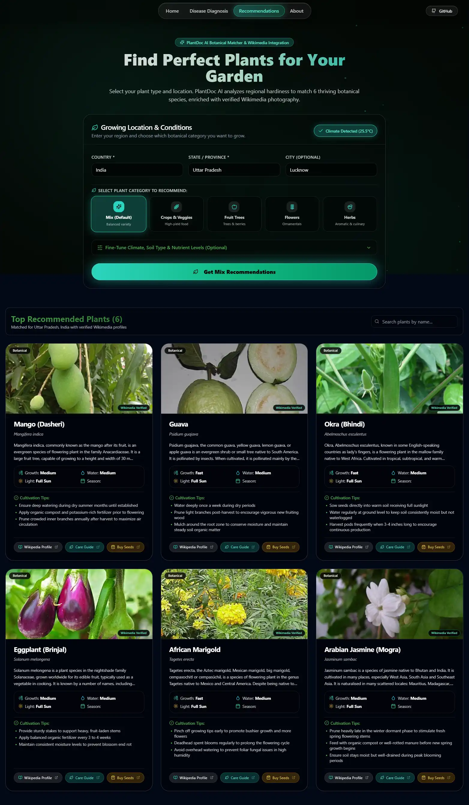

# PlantDoc AI 🌿

> **Next-Generation Botanical AI Vision, Neural Lesion Mapping & Clinical Plant Health Engine**

[](https://reactjs.org/)
[](https://www.typescriptlang.org/)
[](https://vitejs.dev/)
[](https://tailwindcss.com/)
[](https://ai.google.dev/)

---

<p align="center">
  
</p>

---

## 🌟 Overview

**PlantDoc AI** is an advanced botanical diagnostics and regional recommendation engine built for home gardeners, commercial nurseries, and agronomists. By coupling **neural vision segmentation** with **real-world commercial treatment protocols** and **live Wikimedia REST API synchronization**, PlantDoc AI delivers sub-second disease diagnosis, localized foliar coordinates, and verified recovery strategies.

---

## 📸 Platform Showcase

### 🔬 1. Neural Foliar Lesion Localization & Pathology Scanner
Isolates necrotic lesions, chlorotic yellow halos, and active sporulation centers with sub-pixel 2D bounding boxes and interactive pathology coordinate inspection `[ymin, xmin, ymax, xmax]`.

<p align="center">
  
</p>

---

### 🏥 2. Clinical Diagnosis & Vital Health Telemetry
Formulates full clinical pathology dossiers including diagnostic match certainty, pathogen classification, foliar vitality scores, recovery prognosis, and sunlight/hydration metrics.

<p align="center">
  
</p>

---

### 💊 3. Real Commercial Product Prescriptions & 5-Tier Treatment Matrix
Prescribes exact commercial retail brands (e.g. *Daconil Fungicide*, *Bonide Liquid Copper*, *Southern Ag Neem Oil*, *Miracle-Gro Water Soluble All Purpose*, *FoxFarm Grow Big*) with precise dilution dosages and structured 30-day recovery timelines.

<p align="center">
  
</p>

---

### 🌾 4. Climate-Adaptive Recommendation Engine
Selects top botanical species matching your regional climate (temperature, rainfall, soil NPK) backed by authentic **Wikimedia REST API** profiles, high-resolution photography, and care guides.

<p align="center">
  
</p>

---

## ✨ Key Features

### 🔬 Neural Vision & Pathology Localization
- **Sub-Pixel Spatial Coordinates**: Identifies disease perimeters with normalized `[ymin, xmin, ymax, xmax]` coordinates.
- **Interactive Coordinate Inspector**: Click any localized lesion box on the image to inspect affected plant tissue, severity, and confidence metrics.
- **Fast WebP Client-Side Downsampling**: Automatically resizes large DSLR/smartphone photos to progressive WebP in <50ms, reducing network payload by **99%** for 5x–10x faster diagnosis.

### 🛡️ Real Commercial Formulations & 5-Tier Remediation
- **Real Brand Prescriptions**: Recommends genuine retail fertilizers and fungicides with precise dilution rates (e.g. *1/2 tbsp per gallon of water*).
- **Interactive Emergency Checklist**: Check off emergency sanitation steps (tool sterilization, isolation, canopy pruning).
- **Biological & Chemical Arsenal**: Dual coverage spanning bio-organic agents (*Bacillus subtilis*, cold-pressed neem) and curative chemical fungicides.
- **30-Day Recovery Timeline**: Step-by-step milestones from day-1 sanitation to foliar regeneration.

### 🌍 Wikimedia Integration & Climate Modeling
- **Zero Mock Synthetics**: Direct integration with Wikipedia REST APIs to fetch verified botanical taxonomy and cultivation guides.
- **Regional Climate Auto-Detection**: Simulates regional temperature, rainfall, humidity, and soil pH based on Country and State.
- **Species Filtering**: Filter recommendations by **Mix**, **Crops & Veggies**, **Fruit Trees**, **Flowers & Ornamentals**, or **Herbs**.

### ⚡ Ultra-Lightweight & Silky Smooth Architecture
- **Lenis Smooth Inertia Scroll**: 120Hz smooth inertia scrolling synchronized with GSAP's internal RAF ticker.
- **Offscreen Rendering Acceleration**: Below-the-fold sections utilize CSS `content-visibility: auto` to skip unnecessary layout calculations.
- **Auto-Sleep Canvas Loops**: Hero stage and spore particle canvases automatically pause when scrolled out of viewport (0% idle CPU/GPU).

---

## 🚀 Quick Start Guide

### Prerequisites
- [Node.js](https://nodejs.org/) (v18.0.0 or higher)
- npm, yarn, or pnpm

### Installation

1. **Clone the repository:**
   ```bash
   git clone https://github.com/AadishY/PlantDoc.git
   cd PlantDoc
   ```

2. **Install dependencies:**
   ```bash
   npm install
   ```

3. **Configure Environment Variables:**
   Create a `.env` file in the root directory:
   ```env
   VITE_GEMINI_API_KEY=your_gemini_api_key_here
   ```

4. **Launch Development Server:**
   ```bash
   npm run dev
   ```
   Open [http://localhost:8080](http://localhost:8080) in your browser.

5. **Build for Production:**
   ```bash
   npm run build
   ```

---

## 🏗️ Project Architecture

```
plantdoc/
├── public/
│   ├── demo/                               # High-resolution platform screenshots
│   │   ├── home.webp
│   │   ├── diagonosis.webp
│   │   ├── diagnosis fullscreen.webp
│   │   ├── diagonosis 2.webp
│   │   └── recommendations.webp
│   ├── main.webp                           # Hero stage healthy foliage
│   └── main_disease.webp                   # Hero stage pathology reveal layer
├── src/
│   ├── components/
│   │   ├── ClinicalTreatmentProtocol.tsx   # 5-tier treatment matrix & checklist
│   │   ├── DiagnosisVisualizations.tsx     # Vital health metrics & fertilizer cards
│   │   ├── DynamicBackground.tsx           # Adaptive bioluminescent spore canvas
│   │   ├── FixedMobileNav.tsx              # Mobile dock navigation
│   │   ├── Header.tsx                      # Glassmorphic top navigation
│   │   ├── PlantDocHeroStage.tsx           # Interactive 100dvh cursor-masked hero stage
│   │   ├── PlantSegmentationViewer.tsx     # Foliar lesion localization viewer
│   │   ├── ResultComponent.tsx             # Complete diagnostic dashboard
│   │   ├── SmoothScroll.tsx                # Lenis & GSAP ticker integration
│   │   └── SpotlightCard.tsx               # GPU-accelerated cursor spotlight tracking
│   ├── config/
│   │   └── api.config.ts                   # Model endpoints & API configuration
│   ├── pages/
│   │   ├── AboutPage.tsx                   # Creator bio & tech architecture
│   │   ├── DiagnosePage.tsx                # Disease diagnosis engine
│   │   ├── Index.tsx                       # Landing page & feature showcase
│   │   └── RecommendPage.tsx               # Botanical matching & Wikimedia
│   ├── services/
│   │   ├── api.ts                          # Vision diagnosis & WebP compression
│   │   └── wikimedia.ts                    # Live Wikimedia image/article fetcher
│   ├── types/
│   │   ├── diagnosis.ts                    # Pathology & lesion coordinate types
│   │   └── recommendation.ts               # Botanical recommendation schema
│   ├── App.tsx                             # Application root with SmoothScroll & Router
│   ├── index.css                           # Tailwind utilities & performance styles
│   └── main.tsx                            # React entrypoint
├── tailwind.config.ts                      # Design tokens, fonts, and animations
└── vite.config.ts                          # Rollup manualChunks code splitting
```

---

## 📄 License

This project is licensed under the MIT License — see the [LICENSE](LICENSE) file for details.
