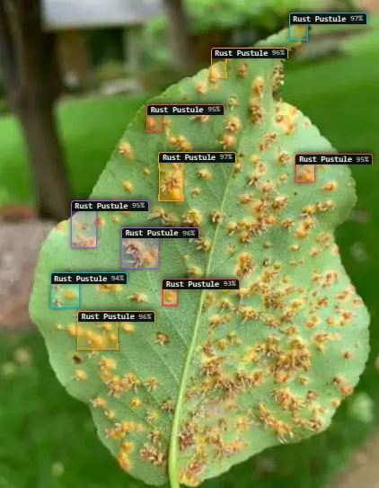
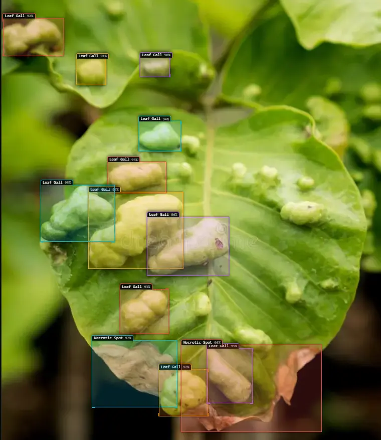
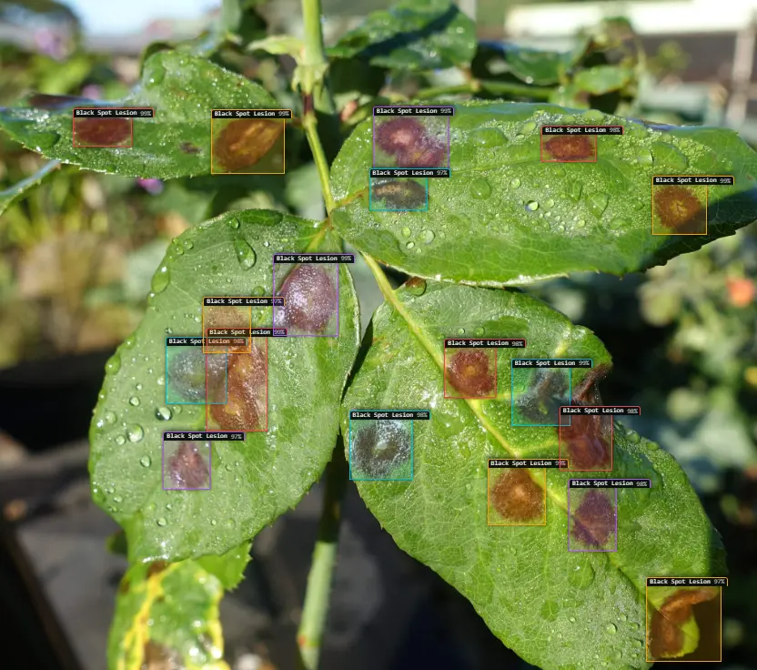
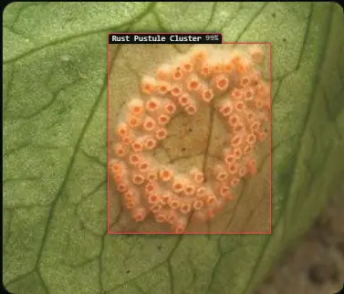
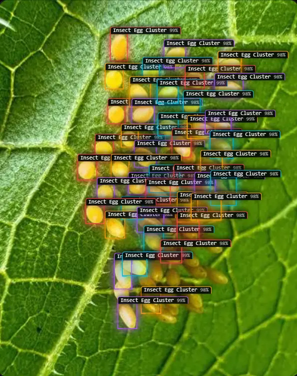

# PlantDoc AI 🌿

> **Next-Generation Botanical AI Vision, Neural Lesion Mapping & Clinical Plant Health Engine**

[](https://reactjs.org/)
[](https://www.typescriptlang.org/)
[](https://vitejs.dev/)
[](https://tailwindcss.com/)
[](https://ai.google.dev/)
[](https://pages.cloudflare.com/)

---

<p align="center">
  
</p>

---

## 🌟 Overview

**PlantDoc AI** is a state-of-the-art botanical intelligence platform engineered for home gardeners, commercial nurseries, and agronomists. By coupling **parallel neural vision segmentation** with **real-world commercial treatment protocols** and **live Wikimedia Foundation REST API synchronization**, PlantDoc AI delivers sub-second disease diagnosis, interactive localized foliar coordinates, and verified recovery strategies.

> 📖 **Developer & AI Agent Guide**: For complete system architecture and codebase specifications, see [AGENTS.md](AGENTS.md).

---

## 📸 Platform Showcase

### 🔬 1. Neural Foliar Lesion Localization & Pathology Scanner
Isolates necrotic lesions, chlorotic yellow halos, and active sporulation centers with sub-pixel 2D bounding boxes and interactive pathology coordinate inspection `[ymin, xmin, ymax, xmax]`.

<p align="center">
  
</p>

---

### 🏥 2. Clinical Diagnosis & Vital Health Telemetry
Formulates full clinical pathology dossiers including diagnostic match certainty, pathogen classification, foliar vitality scores, recovery prognosis, and sunlight/hydration metrics.

<p align="center">
  
</p>

---

### 🔬 3. Diagnostic Result Case Studies & Lesion Segments
Explore real-world botanical pathology diagnoses, sub-pixel multi-spot lesion bounding boxes, and clinical telemetry dossiers across diverse foliar diseases:

<details>
<summary><b>🔍 Expand to View Real-World Diagnostic Case Studies (Specimens 1–6)</b></summary>
<br/>

#### Specimen Analysis & Clinical Protocol Overview
<p align="center">
  
</p>

#### Case Study #1: Early Blight & Foliar Necrosis Localization
<p align="center">
  
</p>

#### Case Study #2: Multi-Spot Septoria & Concentric Ring Lesions
<p align="center">
  
</p>

#### Case Study #3: Powdery Mildew & Chlorotic Halo Spread
<p align="center">
  
</p>

#### Case Study #4: Bacterial Leaf Spot & Marginal Burn
<p align="center">
  
</p>

#### Case Study #5: Rust Pustules & Micro-Spot Localization
<p align="center">
  
</p>

</details>

---

### 🌾 4. Climate-Adaptive Recommendation Engine
Selects top botanical species matching your regional climate (temperature, rainfall, soil NPK) backed by authentic **Wikimedia REST API** profiles, high-resolution photography, and care guides.

<p align="center">
  
</p>

---

## ✨ Key Platform Features

| Capability | Technical Implementation | Benefit |
| :--- | :--- | :--- |
| **Sub-Pixel Spatial Lesion Boxes** | Parallel Gemini Vision segmentation model | Exact 2D bounding boxes around individual spots |
| **Real Commercial Prescriptions** | Validated retail formulations (*Daconil*, *Bonide*, *Miracle-Gro*) | Precise chemical & organic mixing dosages |
| **Client-Side WebP Compression** | Offscreen HTML5 Canvas downsampler | **99% payload reduction** (~80KB transfers, 5x speedup) |
| **Interactive Dual-Mask Hero** | Synchronized `topLayerRef` + `baseLayerRef` masks | Necrotic holes reveal background; 0 dark blobs in air |
| **Verified Botanical Taxonomy** | Live Wikimedia Foundation REST APIs | **Zero synthetic mock images**; authentic high-res data |
| **120Hz Kinetic Inertia Scroll** | Lenis smooth scroll + GSAP RAF ticker sync | Buttery-smooth, jitter-free scroll pacing |
| **Zero GC Animation Loops** | In-place reverse mutation & `Float32Array` buffers | **0 bytes per frame allocations**; 0 frame drops |

---

## ⚡ Performance Benchmarks

- **Display Refresh Rate**: Locked **120fps / 60fps** with zero garbage-collection stutter.
- **Client-Side Image Pre-Processing**: `<50ms` progressive WebP encoding.
- **Production Bundle Size**: Optimized Rollup chunks (`vendor-icons` trimmed 41% to 15.9 KB).
- **CSS Paint Optimization**: `content-visibility: auto` skips offscreen paint passes.
- **Idle Power Draw**: **0% CPU/GPU overhead** when canvas stages scroll out of viewport.

---

## 🚀 Quick Start Guide

### Prerequisites
- [Node.js](https://nodejs.org/) (v18.0.0 or higher)
- npm, yarn, or pnpm

### Installation

1. **Clone the repository:**
   ```bash
   git clone https://github.com/AadishY/PlantDoc.git
   cd PlantDoc
   ```

2. **Install dependencies:**
   ```bash
   npm install
   ```

3. **Configure Environment Variables:**
   Create a `.env` file in the root directory:
   ```env
   VITE_GEMINI_API_KEY=your_gemini_api_key_here
   ```

4. **Launch Development Server:**
   ```bash
   npm run dev
   ```
   Open [http://localhost:8080](http://localhost:8080) in your browser.

5. **Build for Production:**
   ```bash
   npm run build
   ```

---

## 🏗️ Project Directory Architecture

```
plantdoc/
├── public/
│   ├── demo/                               # Platform screenshot showcases
│   ├── bannerr.jpg                         # 1280x640 Social media & OpenGraph banner
│   ├── main.webp                           # Hero stage healthy foliage
│   ├── main_disease.webp                   # Hero stage pathology reveal layer
│   └── _redirects                          # Cloudflare Pages SPA rewrite rule
├── src/
│   ├── components/
│   │   ├── ClinicalTreatmentProtocol.tsx   # 5-tier treatment matrix & checklist
│   │   ├── DiagnosisVisualizations.tsx     # Vital health metrics & fertilizer cards
│   │   ├── DynamicBackground.tsx           # Adaptive bioluminescent spore canvas
│   │   ├── FixedMobileNav.tsx              # Mobile dock navigation
│   │   ├── Header.tsx                      # Glassmorphic top navigation
│   │   ├── PlantDocHeroStage.tsx           # Interactive 100dvh cursor-masked hero stage
│   │   ├── PlantSegmentationViewer.tsx     # Foliar lesion localization viewer
│   │   ├── ResultComponent.tsx             # Complete diagnostic dashboard
│   │   ├── SmoothScroll.tsx                # Lenis & GSAP ticker integration
│   │   └── SpotlightCard.tsx               # GPU-accelerated cursor spotlight tracking
│   ├── config/
│   │   └── api.config.ts                   # Model endpoints & API configuration
│   ├── pages/
│   │   ├── AboutPage.tsx                   # Creator bio & tech architecture
│   │   ├── DiagnosePage.tsx                # Disease diagnosis engine
│   │   ├── Index.tsx                       # Landing page & feature showcase
│   │   └── RecommendPage.tsx               # Botanical matching & Wikimedia
│   ├── services/
│   │   ├── api.ts                          # Vision diagnosis & WebP compression
│   │   └── wikimedia.ts                    # Live Wikimedia image/article fetcher
│   ├── types/
│   │   ├── diagnosis.ts                    # Pathology & lesion coordinate types
│   │   └── recommendation.ts               # Botanical recommendation schema
│   ├── App.tsx                             # Application root with SmoothScroll & Router
│   ├── index.css                           # Tailwind utilities & performance styles
│   └── main.tsx                            # React entrypoint
├── AGENTS.md                               # Canonical architecture & AI agent guide
├── tailwind.config.ts                      # Design tokens, fonts, and animations
└── vite.config.ts                          # Rollup manualChunks code splitting
```

---

## 📄 License

This project is licensed under the MIT License — see the [LICENSE](LICENSE) file for details.
