# PlantDoc AI 🌿

> **Next-Generation Botanical AI Vision, Neural Lesion Mapping & Clinical Plant Health Engine**

[](https://reactjs.org/)
[](https://www.typescriptlang.org/)
[](https://vitejs.dev/)
[](https://tailwindcss.com/)
[](https://ai.google.dev/)
[](https://pages.cloudflare.com/)

---

<p align="center">
  
</p>

---

## 🌟 Overview

**PlantDoc AI** is a state-of-the-art botanical intelligence platform engineered for home gardeners, commercial nurseries, and agronomists. By coupling **parallel neural vision segmentation** with **real-world commercial treatment protocols** and **live Wikimedia Foundation REST API synchronization**, PlantDoc AI delivers sub-second disease diagnosis, interactive localized foliar coordinates, and verified recovery strategies.

> 📖 **Developer & AI Agent Guide**: For complete system architecture, failover cascades, and design system tokens, see [AGENTS.md](AGENTS.md).

---

## 📸 Platform Showcase

### 🔬 1. Neural Foliar Lesion Localization & Pathology Scanner
Isolates necrotic lesions, chlorotic yellow halos, and active sporulation centers with sub-pixel 2D bounding boxes and interactive pathology coordinate inspection `[ymin, xmin, ymax, xmax]`.

<p align="center">
  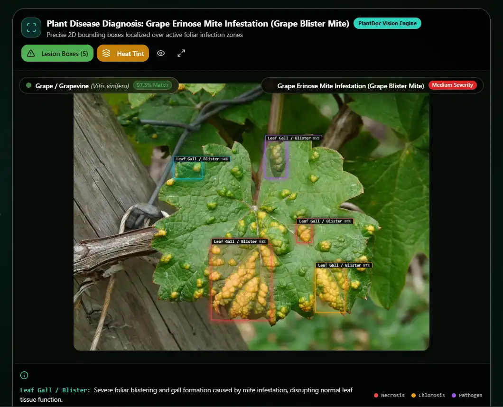
</p>

---

### 🏥 2. Clinical Diagnosis & Vital Health Telemetry
Formulates full clinical pathology dossiers including diagnostic match certainty, pathogen classification, foliar vitality scores, recovery prognosis, and sunlight/hydration metrics.

<p align="center">
  
</p>

---

### 🔬 3. Diagnostic Result Case Studies & Lesion Segments
Explore real-world botanical pathology diagnoses, sub-pixel multi-spot lesion bounding boxes, and clinical telemetry dossiers across diverse foliar diseases:

<details>
<summary><b>🔍 Expand to View Real-World Diagnostic Case Studies (Specimens 1–6)</b></summary>
<br/>

#### Specimen Analysis & Clinical Protocol Overview
<p align="center">
  
</p>

#### Case Study #1: Early Blight & Foliar Necrosis Localization
<p align="center">
  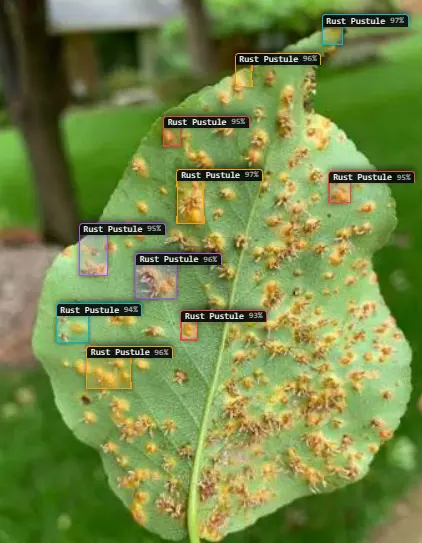
</p>

#### Case Study #2: Multi-Spot Septoria & Concentric Ring Lesions
<p align="center">
  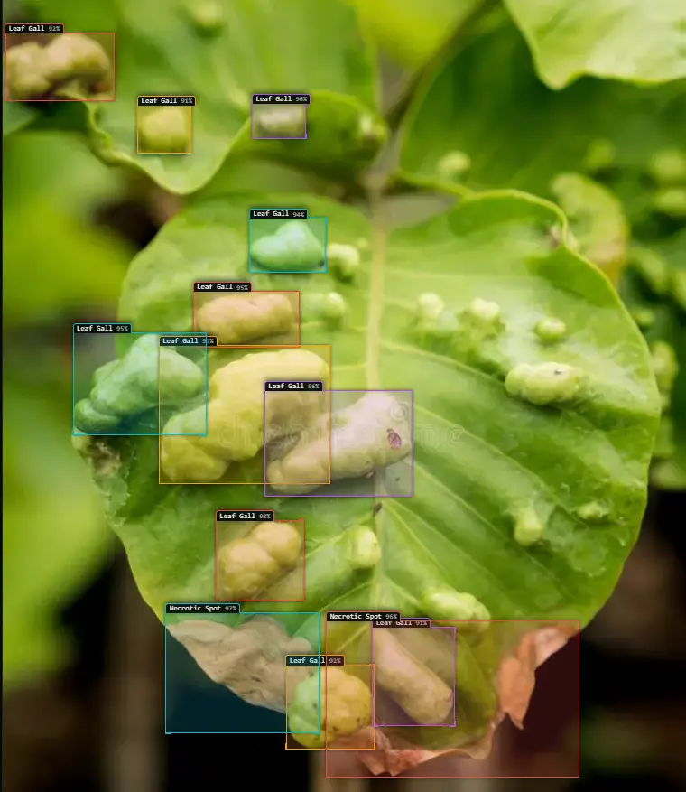
</p>

#### Case Study #3: Powdery Mildew & Chlorotic Halo Spread
<p align="center">
  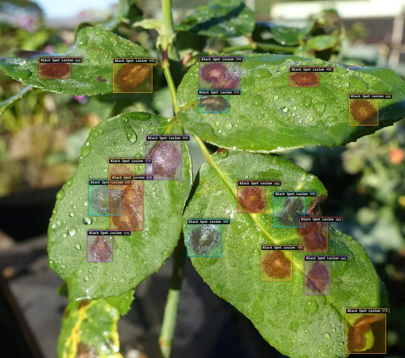
</p>

#### Case Study #4: Bacterial Leaf Spot & Marginal Burn
<p align="center">
  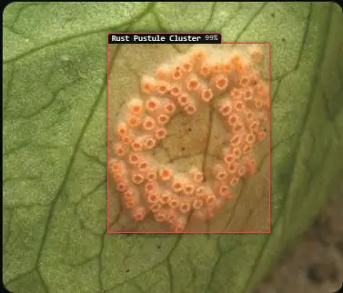
</p>

#### Case Study #5: Rust Pustules & Micro-Spot Localization
<p align="center">
  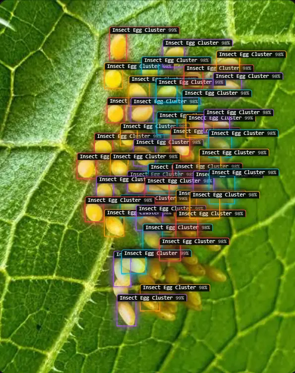
</p>

</details>

---

### 🌾 4. Climate-Adaptive Recommendation Engine
Selects top botanical species matching your regional climate (temperature, rainfall, soil NPK) backed by authentic **Wikimedia REST API** profiles, high-resolution photography, and care guides.

<p align="center">
  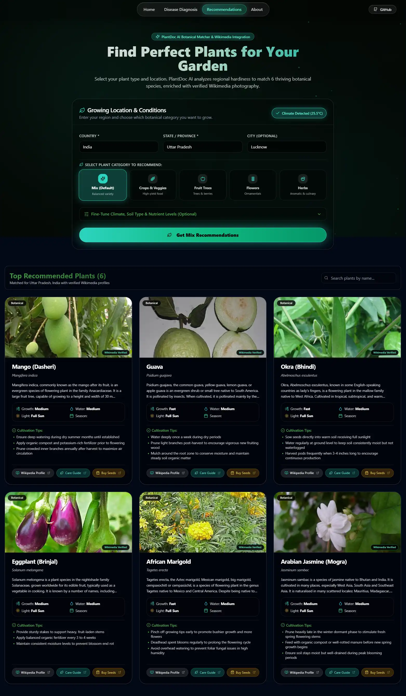
</p>

---

## ✨ Key Platform Features

| Capability | Technical Implementation | Practical Clinical Benefit |
| :--- | :--- | :--- |
| **Scientific Veracity & Anti-Hallucination** | Dual-tier verification & specimen validation | **Zero fabricated diseases**: explicitly rejects non-botanical images or marks ambiguous foliage as inconclusive. |
| **Multi-Scale Spatial Lesion Grounding** | `gemini-3.7-flash` + NMS IoU filtering | Pinpoints both **macro affected disease zones** (blight scorch, marginal burn) and **micro focal spots** (10 to 45+ detections, `IoU > 0.65`). |
| **3-Tier Diagnostic Failover Cascade** | `gemini-3.6-flash` ➔ `gemini-3.7-flash` ➔ `gemini-3.8-flash` | **100% resilient clinical pathology**: seamless background auto-failover with live user notifications. |
| **Gemma 4 Climate Recommendation Engine** | `gemma-4-26b-a4b-it` ➔ `gemini-3.5-flash-lite` ➔ `gemini-2.5-flash` | High-speed agronomic matching (~2.5s to 4s response) against regional temperature, precipitation, and soil profiles. |
| **Interactive 5-Option Season Engine** | Real-time seasonal planting calendar sync | Curates species by seasonal window (**All Seasons**, **Spring**, **Summer**, **Autumn**, **Winter**) with timeline badges. |
| **Spectral NDVI Chlorophyll Analysis** | Simulated multispectral foliar mapping | Visualizes photosynthetic vigor, chlorophyll breakdown, and sub-clinical symptom margins. |
| **Infection Stage & Severity Horizon** | Dynamic progression timeline with phase details | Interactive 4-phase progression tracker revealing symptoms and intervention windows per stage. |
| **5-Tier Clinical Treatment Matrix** | Validated retail formulations (*Daconil*, *Bonide*, *Monterey*) | Exact commercial chemical, bio-fungicidal, and organic mixing ratios and application cycles. |
| **Client-Side WebP Downsampling** | Offscreen HTML5 Canvas downsampler | **99% network payload reduction** (~80KB transfers, 5x–10x API latency speedup). |
| **Zero-Freeze Fluid Morph Hero Stage** | Synchronized native CSS masks with area squash & stretch | Organic healthy-to-pathology reveal, viscous metaball neck bridge, and instant dew evaporation on leave. |
| **Verified Botanical Taxonomy** | Live Wikimedia Foundation REST APIs | **Zero synthetic mock images**; authentic high-res botanical taxonomy and care guides. |
| **120Hz Kinetic Inertia Scroll** | Lenis smooth scroll + GSAP RAF ticker sync | Buttery-smooth, jitter-free kinetic scroll pacing across desktop and mobile. |
| **Same-Origin AI Gateway** | Cloudflare Pages Function + Vite middleware | **Zero leaked API keys**: server-side provider authentication with route allowlisting. |

---

## 🔬 System Architecture & Flowcharts

### 1. Dual-Stream Vision Diagnostics & Spatial Lesion Grounding Pipeline

The vision diagnostics pipeline processes user photos through parallel execution streams to generate unified clinical dossiers:

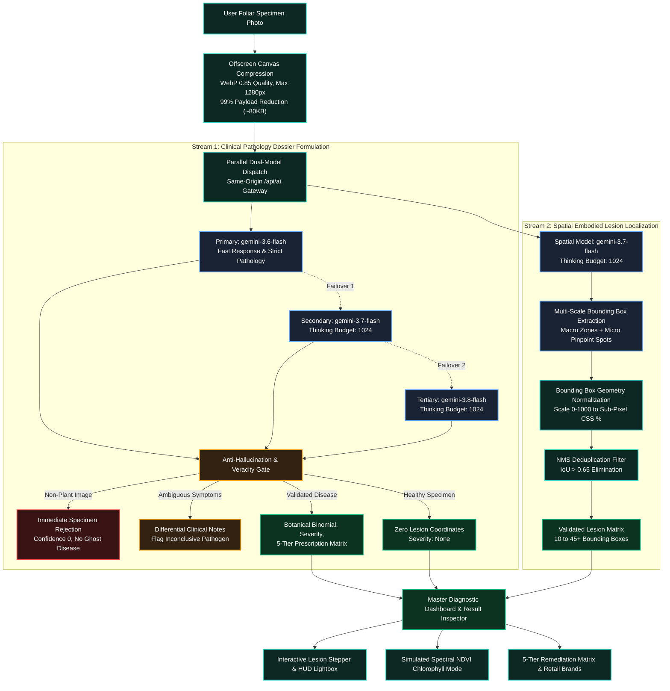
```mermaid
graph TD
    classDef client fill:#0d2822,stroke:#2dd4bf,stroke-width:2px,color:#fff;
    classDef model fill:#1a2333,stroke:#60a5fa,stroke-width:2px,color:#fff;
    classDef verify fill:#332211,stroke:#f59e0b,stroke-width:2px,color:#fff;
    classDef success fill:#0b3320,stroke:#10b981,stroke-width:2px,color:#fff;
    classDef fail fill:#3a1414,stroke:#ef4444,stroke-width:2px,color:#fff;

    A["User Foliar Specimen Photo"]:::client --> B["Offscreen Canvas Compression<br/>WebP 0.85 Quality, Max 1280px<br/>99% Payload Reduction (~80KB)"]:::client
    
    B --> C["Parallel Dual-Model Dispatch<br/>Same-Origin /api/ai Gateway"]:::client
    
    subgraph StreamA["Stream 1: Clinical Pathology Dossier Formulation"]
        C --> D1["Primary: gemini-3.6-flash<br/>Fast Response & Strict Pathology"]:::model
        D1 -.->|"Failover 1"| D2["Secondary: gemini-3.7-flash<br/>Thinking Budget: 1024"]:::model
        D2 -.->|"Failover 2"| D3["Tertiary: gemini-3.8-flash<br/>Thinking Budget: 1024"]:::model
        D1 & D2 & D3 --> E["Anti-Hallucination & Veracity Gate"]:::verify
        E -->|"Non-Plant Image"| E_REJECT["Immediate Specimen Rejection<br/>Confidence 0, No Ghost Disease"]:::fail
        E -->|"Ambiguous Symptoms"| E_AMBIG["Differential Clinical Notes<br/>Flag Inconclusive Pathogen"]:::verify
        E -->|"Healthy Specimen"| E_HEALTHY["Zero Lesion Coordinates<br/>Severity: None"]:::success
        E -->|"Validated Disease"| E_VALID["Botanical Binomial, Severity,<br/>5-Tier Prescription Matrix"]:::success
    end

    subgraph StreamB["Stream 2: Spatial Embodied Lesion Localization"]
        C --> F1["Spatial Model: gemini-3.7-flash<br/>Thinking Budget: 1024"]:::model
        F1 --> F2["Multi-Scale Bounding Box Extraction<br/>Macro Zones + Micro Pinpoint Spots"]:::model
        F2 --> F3["Bounding Box Geometry Normalization<br/>Scale 0-1000 to Sub-Pixel CSS %"]:::client
        F3 --> F4["NMS Deduplication Filter<br/>IoU > 0.65 Elimination"]:::client
        F4 --> F5["Validated Lesion Matrix<br/>10 to 45+ Bounding Boxes"]:::success
    end

    E_VALID & E_HEALTHY & F5 --> G["Master Diagnostic Dashboard & Result Inspector"]:::success
    G --> H1["Interactive Lesion Stepper & HUD Lightbox"]:::client
    G --> H2["Simulated Spectral NDVI Chlorophyll Mode"]:::client
    G --> H3["5-Tier Remediation Matrix & Retail Brands"]:::client
```

---

### 2. Botanical Recommendation & Seasonal Intelligence Engine

Curates climate-matched botanical varieties using Google's Gemma 4 open weights model family with fast Gemini failover and authentic Wikimedia photography:

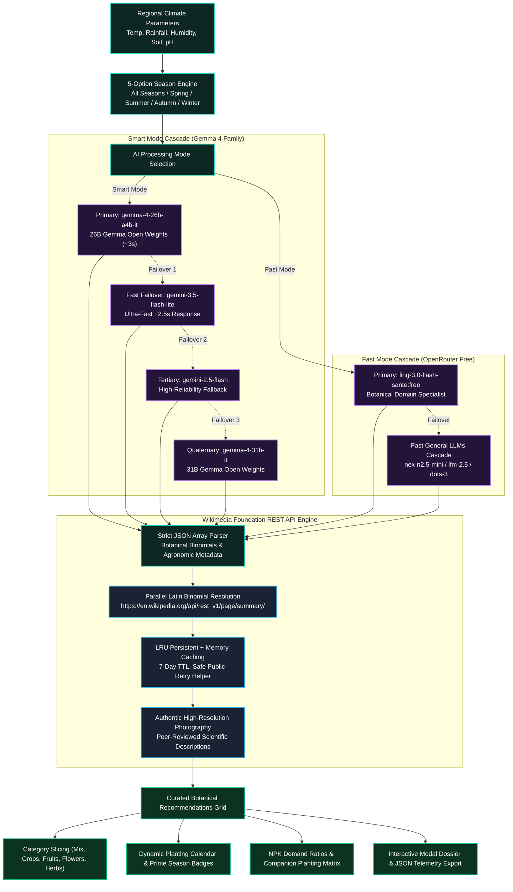
```mermaid
graph TD
    classDef input fill:#0d2822,stroke:#2dd4bf,stroke-width:2px,color:#fff;
    classDef gemma fill:#24143a,stroke:#c084fc,stroke-width:2px,color:#fff;
    classDef wiki fill:#1a2333,stroke:#38bdf8,stroke-width:2px,color:#fff;
    classDef output fill:#0b3320,stroke:#10b981,stroke-width:2px,color:#fff;

    A["Regional Climate Parameters<br/>Temp, Rainfall, Humidity, Soil, pH"]:::input --> B["5-Option Season Engine<br/>All Seasons / Spring / Summer / Autumn / Winter"]:::input
    B --> C["AI Processing Mode Selection"]:::input

    subgraph ModeSmart["Smart Mode Cascade (Gemma 4 Family)"]
        C -->|"Smart Mode"| D1["Primary: gemma-4-26b-a4b-it<br/>26B Gemma Open Weights (~3s)"]:::gemma
        D1 -.->|"Failover 1"| D2["Fast Failover: gemini-3.5-flash-lite<br/>Ultra-Fast ~2.5s Response"]:::gemma
        D2 -.->|"Failover 2"| D3["Tertiary: gemini-2.5-flash<br/>High-Reliability Fallback"]:::gemma
        D3 -.->|"Failover 3"| D4["Quaternary: gemma-4-31b-it<br/>31B Gemma Open Weights"]:::gemma
    end

    subgraph ModeFast["Fast Mode Cascade (OpenRouter Free)"]
        C -->|"Fast Mode"| E1["Primary: ling-3.0-flash-sante:free<br/>Botanical Domain Specialist"]:::gemma
        E1 -.->|"Failover"| E2["Fast General LLMs Cascade<br/>nex-n2.5-mini / lfm-2.5 / dots-3"]:::gemma
    end

    D1 & D2 & D3 & D4 & E1 & E2 --> F["Strict JSON Array Parser<br/>Botanical Binomials & Agronomic Metadata"]:::input

    subgraph WikiEngine["Wikimedia Foundation REST API Engine"]
        F --> G["Parallel Latin Binomial Resolution<br/>https://en.wikipedia.org/api/rest_v1/page/summary/"]:::wiki
        G --> H["LRU Persistent + Memory Caching<br/>7-Day TTL, Safe Public Retry Helper"]:::wiki
        H --> I["Authentic High-Resolution Photography<br/>Peer-Reviewed Scientific Descriptions"]:::wiki
    end

    I --> J["Curated Botanical Recommendations Grid"]:::output
    J --> K1["Category Slicing (Mix, Crops, Fruits, Flowers, Herbs)"]:::output
    J --> K2["Dynamic Planting Calendar & Prime Season Badges"]:::output
    J --> K3["NPK Demand Ratios & Companion Planting Matrix"]:::output
    J --> K4["Interactive Modal Dossier & JSON Telemetry Export"]:::output
```

---

### 3. Hero Stage Fluid Morph Masking & Touch Interaction Engine

High-performance GPU-composited CSS masking simulating liquid droplet surface tension with zero artificial freeze:

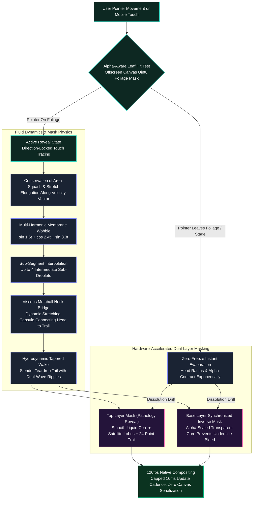
```mermaid
graph TD
    classDef stage fill:#0d2822,stroke:#2dd4bf,stroke-width:2px,color:#fff;
    classDef physics fill:#1a2333,stroke:#818cf8,stroke-width:2px,color:#fff;
    classDef render fill:#24143a,stroke:#f472b6,stroke-width:2px,color:#fff;
    classDef out fill:#0b3320,stroke:#10b981,stroke-width:2px,color:#fff;

    A["User Pointer Movement or Mobile Touch"]:::stage --> B{"Alpha-Aware Leaf Hit Test<br/>Offscreen Canvas Uint8 Foliage Mask"}:::stage
    
    B -->|"Pointer On Foliage"| C1["Active Reveal State<br/>Direction-Locked Touch Tracing"]:::stage
    B -->|"Pointer Leaves Foliage / Stage"| C2["Zero-Freeze Instant Evaporation<br/>Head Radius & Alpha Contract Exponentially"]:::physics

    subgraph PhysicsEngine["Fluid Dynamics & Mask Physics"]
        C1 --> D1["Conservation of Area Squash & Stretch<br/>Elongation Along Velocity Vector"]:::physics
        D1 --> D2["Multi-Harmonic Membrane Wobble<br/>sin 1.6t + cos 2.4t + sin 3.3t"]:::physics
        D2 --> D3["Sub-Segment Interpolation<br/>Up to 4 Intermediate Sub-Droplets"]:::physics
        D3 --> D4["Viscous Metaball Neck Bridge<br/>Dynamic Stretching Capsule Connecting Head to Trail"]:::physics
        D4 --> D5["Hydrodynamic Tapered Wake<br/>Slender Teardrop Tail with Dual-Wave Ripples"]:::physics
    end

    subgraph Compositing["Hardware-Accelerated Dual-Layer Masking"]
        D5 --> E1["Top Layer Mask (Pathology Reveal)<br/>Smooth Liquid Core + Satellite Lobes + 24-Point Trail"]:::render
        D5 --> E2["Base Layer Synchronized Inverse Mask<br/>Alpha-Scaled Transparent Core Prevents Underside Bleed"]:::render
        C2 -->|"Dissolution Drift"| E1 & E2
    end

    E1 & E2 --> F["120fps Native Compositing<br/>Capped 16ms Update Cadence, Zero Canvas Serialization"]:::out
```

---

### 4. Zero-Trust Edge Security & AI Gateway Architecture

Protects API keys and validates upstream traffic through same-origin edge routing:

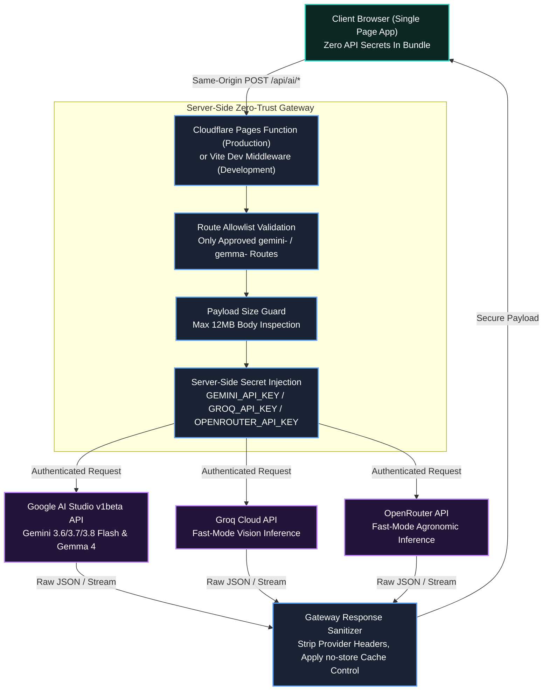
```mermaid
graph TD
    classDef client fill:#0d2822,stroke:#2dd4bf,stroke-width:2px,color:#fff;
    classDef edge fill:#1a2333,stroke:#60a5fa,stroke-width:2px,color:#fff;
    classDef provider fill:#24143a,stroke:#c084fc,stroke-width:2px,color:#fff;

    A["Client Browser (Single Page App)<br/>Zero API Secrets In Bundle"]:::client -->|"Same-Origin POST /api/ai/*"| B["Cloudflare Pages Function (Production)<br/>or Vite Dev Middleware (Development)"]:::edge

    subgraph Gateway["Server-Side Zero-Trust Gateway"]
        B --> C1["Route Allowlist Validation<br/>Only Approved gemini- / gemma- Routes"]:::edge
        C1 --> C2["Payload Size Guard<br/>Max 12MB Body Inspection"]:::edge
        C2 --> C3["Server-Side Secret Injection<br/>GEMINI_API_KEY / GROQ_API_KEY / OPENROUTER_API_KEY"]:::edge
    end

    C3 -->|"Authenticated Request"| D1["Google AI Studio v1beta API<br/>Gemini 3.6/3.7/3.8 Flash & Gemma 4"]:::provider
    C3 -->|"Authenticated Request"| D2["Groq Cloud API<br/>Fast-Mode Vision Inference"]:::provider
    C3 -->|"Authenticated Request"| D3["OpenRouter API<br/>Fast-Mode Agronomic Inference"]:::provider

    D1 & D2 & D3 -->|"Raw JSON / Stream"| E["Gateway Response Sanitizer<br/>Strip Provider Headers, Apply no-store Cache Control"]:::edge
    E -->|"Secure Payload"| A
```

---

## ⚡ Performance Benchmarks

- **Display Refresh Rate**: Sustained **120fps / 60fps** with zero garbage-collection pauses.
- **Client-Side Image Pre-Processing**: `<50ms` progressive WebP encoding on offscreen Canvas.
- **Payload Compression**: 10MB+ raw DSLR files compressed to **~80KB–150KB** prior to cloud transit (99% reduction).
- **Production Bundle Size**: Optimized Rollup manual chunks (`vendor-react`, `vendor-animation`, `vendor-radix`, `vendor-charts`, `vendor-icons`).
- **Gemma Recommendation Latency**: Fast ~2.5s–4s response via `gemma-4-26b-a4b-it` & `gemini-3.5-flash-lite`.
- **CSS Paint Optimization**: `content-visibility: auto` skips offscreen paint passes.
- **Connectivity Resilience**: Offline-aware UI, real request deadlines, model failover, and persistent Wikimedia cache (7-day TTL).
- **Idle Power Draw**: Zero CPU/GPU cycles when hero stage is idle or out of viewport.

---

## 🚀 Quick Start Guide

### Prerequisites
- [Node.js](https://nodejs.org/) (v18.0.0 or higher)
- npm, yarn, or pnpm

### Installation

1. **Clone the repository:**
   ```bash
   git clone https://github.com/AadishY/plantdoc.git
   cd plantdoc
   ```

2. **Install dependencies:**
   ```bash
   npm install
   ```

3. **Configure Environment Variables:**
   Create a `.env` file in the root directory (see `.env.example`):
   ```env
   # Required: Google Gemini API Key (Gemini Vision & Gemma models)
   # SERVER-ONLY — no VITE_ prefix, so it is never inlined into the browser bundle.
   GEMINI_API_KEY=your_gemini_api_key_here

   # Optional: Groq API Key (for Fast Mode vision pathology diagnosis)
   GROQ_API_KEY=your_groq_api_key_here

   # Optional: OpenRouter API Key (for Fast Mode botanical recommendations)
   OPENROUTER_API_KEY=your_openrouter_api_key_here

   # Recommended: Custom Wikimedia User-Agent for REST API compliance
   VITE_WIKIMEDIA_USER_AGENT=PlantDoc/1.0 (https://plantdoc.app; contact@plantdoc.app)
   ```

   > 🔐 **Security Note**: Model keys are consumed exclusively by the same-origin AI gateway (`/api/ai/*`) — a Cloudflare Pages Function in production and Vite middleware in development. The browser never sees a provider URL or API key. On Cloudflare Pages, configure these variables as project environment secrets.

4. **Launch Development Server:**
   ```bash
   npm run dev
   ```
   Open [http://localhost:3000](http://localhost:3000) in your browser.

5. **Build for Production:**
   ```bash
   npm run build
   ```

6. **Preview Production Build:**
   ```bash
   npm run preview
   ```

---

## 🏗️ Project Directory Architecture

```
plantdoc/
├── public/
│   ├── demo/                               # Platform screenshot showcases
│   ├── bannerr.jpg                         # 1280x640 Social media & OpenGraph banner
│   ├── main.webp                           # Hero stage healthy foliage specimen
│   ├── main_disease.webp                   # Hero stage pathology reveal layer
│   ├── robots.txt                          # Search engine crawling rules
│   ├── sitemap.xml                         # Production SEO sitemap
│   ├── _headers                            # Cloudflare Pages security & caching headers
│   └── _redirects                          # Cloudflare Pages SPA rewrite rule (/* /index.html 200)
├── functions/
│   └── api/ai/[[path]].ts                  # Cloudflare Pages server-side AI gateway
├── server/
│   ├── aiProxy.ts                          # Shared gateway logic & key injection
│   └── viteAiProxyPlugin.ts                # Vite dev server proxy middleware
├── src/
│   ├── components/
│   │   ├── ui/                             # Radix UI primitives & enhanced cards
│   │   ├── ClinicalTreatmentProtocol.tsx   # 5-tier remediation checklist & brand prescriptions
│   │   ├── DiagnosisVisualizations.tsx     # Vital rings, radar charts, infection stage horizon
│   │   ├── DynamicBackground.tsx           # Adaptive ambient spore canvas with scroll pause
│   │   ├── FixedMobileNav.tsx              # Mobile dock navigation
│   │   ├── Footer.tsx                      # Global footer with credits & legal policies
│   │   ├── Header.tsx                      # Glassmorphic top navigation with route indicators
│   │   ├── MetricsShowcase.tsx             # Animated clinical performance metrics & counters
│   │   ├── ParallaxSection.tsx             # 3D interactive intelligence showcase cards
│   │   ├── PlantDocHeroStage.tsx           # Zero-freeze fluid morph interactive hero stage
│   │   ├── PlantSegmentationViewer.tsx     # Foliar lesion localization viewer with NDVI mode
│   │   ├── ResultComponent.tsx             # Master diagnosis dashboard container
│   │   ├── SmoothScroll.tsx                # Lenis & GSAP ticker integration
│   │   ├── SpotlightCard.tsx               # GPU-accelerated cursor spotlight tracking
│   │   └── UploadComponent.tsx             # Drag-and-drop foliar photo uploader
│   ├── config/
│   │   └── api.config.ts                   # Model endpoints & API configuration
│   ├── hooks/
│   │   ├── use-mobile.tsx                  # Viewport breakpoint detection hook
│   │   ├── use-scroll-animation.tsx        # Optimized parallax & section observers
│   │   ├── use-toast.ts                    # Radix toast notification hook
│   │   └── useDocumentTitle.ts             # Dynamic SEO metadata & title manager
│   ├── pages/
│   │   ├── AboutPage.tsx                   # System architecture & developer info
│   │   ├── DiagnosePage.tsx                # Foliar pathology diagnosis & scanning
│   │   ├── Index.tsx                       # Landing page with interactive hero stage
│   │   ├── NotFound.tsx                    # 404 fallback with botanical blessings
│   │   ├── PrivacyPage.tsx                 # Zero-retention privacy & data security policy
│   │   └── RecommendPage.tsx               # Climate-adaptive botanical recommendation engine
│   ├── services/
│   │   ├── api.ts                          # Vision API cascade, WebP downsampling & NMS filter
│   │   └── wikimedia.ts                    # Live Wikimedia REST API client & cache
│   ├── types/
│   │   ├── diagnosis.ts                    # Clinical diagnosis & lesion coordinate types
│   │   └── recommendation.ts               # Agronomic recommendation & climate types
│   ├── utils/
│   │   ├── network.ts                      # Network status, deadlines & retry helpers
│   │   └── routePreloader.ts               # Proactive route chunk prefetcher
│   ├── App.tsx                             # Application root with SmoothScroll & Router
│   ├── index.css                           # Tailwind utilities & performance styles
│   └── main.tsx                            # React entrypoint
├── AGENTS.md                               # Canonical architecture & AI agent guide
├── tailwind.config.ts                      # Design tokens, fonts, and animations
├── tsconfig.json                           # TypeScript compiler configuration
└── vite.config.ts                          # Rollup manualChunks code splitting
```

---

## 📄 License

This project is licensed under the MIT License — see the [LICENSE](LICENSE) file for details.
